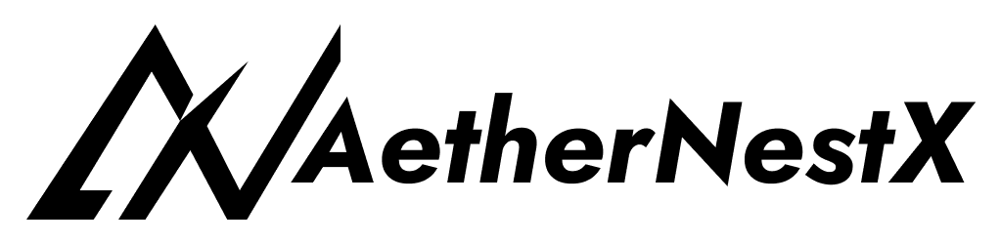

# AetherNestX

## A futuristic, cloud-powered dev workspace with a community feel.

### 1. Platform Overview
**AetherNestX** is an all-in-one, cloud-powered workspace designed for full-stack developers, enabling real-time collaboration, seamless project tracking, and AI-driven code assistance. It eliminates workflow friction by integrating coding, DevOps, and project management into a single environment.

### 2. Motto
**"Seamless DevOps, Limitless Possibilities."**

### 3. Tagline
- **"Sync. Build. Innovate."**  
- **"One Platform. Infinite Innovation."**

### 4. Branding Guide
#### Brand Identity:
AetherNestX embodies a futuristic, synchronized, and scalable development environment where teams work effortlessly.

#### Brand Personality:
✅ **Innovative** – Cutting-edge, AI-powered collaboration.  
✅ **Reliable** – A trusted, efficient workspace.  
✅ **Effortless** – Frictionless syncing and automation.  
✅ **Scalable** – Designed for individuals to enterprise-level teams.  

### 5. Monetization Strategy
#### Freemium Model:
- Free tier with basic collaboration features.
- Paid plans for advanced AI tools, DevOps automation, and integrations.

#### Subscription Plans:
- **Individual Developer Plan**: xxxx/month (AI assistance, private projects, cloud storage).
- **Startup Plan**: xxxxx/month (team collaboration, CI/CD integration, analytics).
- **Enterprise Plan**: Custom pricing (dedicated infrastructure, premium support, compliance tools).

#### Marketplace & Integrations:
- Allow third-party plugin sales.
- API access for external tool integrations.

#### White-labeling & Enterprise Solutions:
- Offer custom deployments for large organizations.

### 6. Enhancing the Platform
🔹 **AI-Driven Features**: Smart code reviews, automated bug fixes.  
🔹 **Live Coding with Pair Programming**: In-browser coding collaboration.  
🔹 **Blockchain-Based Version Control**: Immutable code history.  
🔹 **Deeper Cloud Integrations**: Sync with AWS, GCP, Azure.  
🔹 **Gamification**: Leaderboards, coding challenges, achievements.  

### 7. Required Tools & Tech Stack
- **Frontend**: React.js (Next.js), Tailwind CSS
- **Backend**: Node.js, Firebase, GraphQL
- **Database**: PostgreSQL, Firebase Firestore
- **DevOps**: Docker, Kubernetes, GitHub Actions
- **AI/ML**: OpenAI API for code suggestions, LangChain for automation
- **Collaboration**: WebRTC, Socket.io

### 8. Competitive Differentiation
#### How AetherNestX Stands Out:
✅ **All-in-One Platform**: Unlike Atlassian (Jira + Bitbucket + Trello), AetherNestX combines coding, collaboration, and DevOps in one seamless workspace.  
✅ **AI-Powered Code Assistance**: Competing with GitHub Copilot, but built directly into a team environment.  
✅ **Real-Time Collaboration**: Unlike GitHub Codespaces, we provide instant workspace syncing and live coding.  
✅ **Integrated CI/CD & DevOps**: No need for third-party tools like Jenkins or CircleCI.  

### 9. Target Audience
🎯 **Solo Developers & Freelancers** – Need an all-in-one coding environment.  
🎯 **Startups & Dev Teams** – Require seamless collaboration and CI/CD integration.  
🎯 **Enterprises** – Want secure, scalable, and private cloud-based development.  
🎯 **Open Source Communities** – Need real-time coding and version control tools.  

---
🚀 **AetherNestX is set to redefine full-stack development collaboration.** With its AI-driven, cloud-powered, and real-time syncing capabilities, it is the next evolution of how teams build software together.

